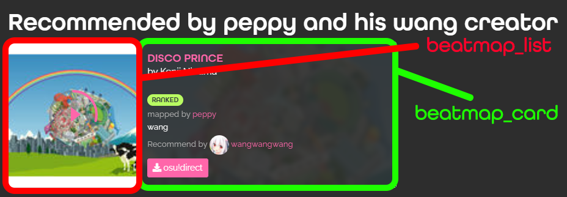

# Introduction

Welcome to the documentation of Rūrusetto API. You can get the information about all API methods here.

# Warning

We cannot notice you on the breaking change, but you can track or check the breaking changes by
- Turn on notification on [the site's main repositories](https://github.com/Rurusetto/rurusetto) for notice the breaking change in [our release note](https://github.com/Rurusetto/rurusetto/releases)
- Check on [changelog and breaking changes](api-change-and-breaking-changes.md) for breaking change history.

# Terms of Use

This API is not required key. You can use it without any restrictions. Just don't abuse it.

Current limit rate is set at an insane rate of 1200 requests per minutes. If you use more than that, you should be idiot.

# Endpoints

## Base URL

The base URL of the API is `https://rulesets.info/api/`.

## Files

All file that's available in the API must start with `https://rulesets.info/media/`.

# Timezones

All dates and times are in UTC.

# Rulesets

## Listing

Get the list of all rulesets that's use in rendering the [listing](https://rulesets.info/listing) page.

    GET https://rulesets.info/api/rulesets

### Response format

| Name                 | Type        | Description                                                                                                                                                     |
|----------------------|-------------|-----------------------------------------------------------------------------------------------------------------------------------------------------------------|
| id                   | integer     | The ID of the ruleset in Rūrusetto database.                                                                                                                    |
| name                 | string      | The name of the ruleset.                                                                                                                                        |
| slug                 | string      | The slug of the ruleset. Use in the URL of the ruleset's wiki page.                                                                                             |
| description          | string      | The short description of the rulesets.                                                                                                                          |
| icon                 | string      | The URL of the ruleset icon that use in website's default theme (dark theme).                                                                                   |
| light_icon           | string      | The URL of the ruleset icon that use in website's light theme.                                                                                                  |
| owner_detail         | user_detail | The [user_detail](#user_detail) of the ruleset's current owner                                                                                                  |
| verified             | boolean     | True if the wiki maintainer has verified that the the owner is the real owner of this ruleset.                                                                  |
| archive              | boolean     | True if the rulesets is stop update or archived by rulesets creator.                                                                                            |
| direct_download_link | string      | URL for download the latest release of ruleset from GitHub                                                                                                      |
| can_download         | boolean     | True if website can render the direct download link from the `source` and `github_download_filename` so user can download directly from `direct_download_link`. |
| status               | status      | The [status](#status) of the ruleset.                                                                                                                           |

### Example response (200)

```json
[
    {
        "id": 1,
        "name": "sentakki",
        "slug": "sentakki",
        "description": "TAP, HOLD and SLIDE to the beat",
        "icon": "/media/rulesets_icon/lol_icon.png",
        "light_icon": "/media/rulesets_icon_light/lol_icon.png",
        "owner_detail": {
            "id": 4,
            "user": {
                "username": "Bloom",
                "email": ""
            },
            "image": "/media/profile_pics/Very_not_so_pink_avatar_trnsprncy.png"
        },
        "verified": true,
        "archive": false,
        "direct_download_link": "https://github.com/LumpBloom7/sentakki/releases/latest/download/osu.Game.Rulesets.Sentakki.dll",
        "can_download": true,
        "status": {
            "latest_version": "2021.1127.0",
            "latest_update": "2021-11-27T10:41:54Z",
            "pre_release": false,
            "changelog": "Thank you for showing interest in this ruleset. This is a tagged release (2021.1127.0).\r\nIf you like this ruleset, do consider [supporting me](https://lumpbloom7.github.io/sponsor).\r\n\r\n**This release resolves a minor SR incompatibility that could occur on the `2021.1127.0` release of osu!lazer**\r\n\r\n## What's Changed\r\n* Bump ppy.osu.Game from 2021.1120.0 to 2021.1127.0 by @dependabot in https://github.com/LumpBloom7/sentakki/pull/286\r\n\r\n\r\n**Full Changelog**: https://github.com/LumpBloom7/sentakki/compare/2021.1120.0...2021.1127.0\r\n\r\n## Feedback\r\nComplaints? Suggestion? Or just want to discuss stuff?\r\n\r\nFeel free to join the [sentakki discord](https://discord.gg/CQPNADu) for a direct communication line to devs, and exclusive access to insider test builds.\r\n\r\n## Installation\r\n[Refer to this wiki page](https://github.com/LumpBloom7/sentakki/wiki/Ruleset-installation-guide)",
            "file_size": 927744,
            "playable": "yes"
        }
    }, {...}, {...}
]
```

## Details

Get the full details of a request ruleset.

    GET https://rulesets.info/api/rulesets/{ruleset-slug}

### Response format

| Name                     | Type        | Description                                                                                                                                                     |
|--------------------------|-------------|-----------------------------------------------------------------------------------------------------------------------------------------------------------------|
| id                       | integer     | The ID of the ruleset in Rūrusetto database.                                                                                                                    |
| name                     | string      | The name of the ruleset.                                                                                                                                        |
| slug                     | string      | The slug of the ruleset. Use in the URL of the ruleset's wiki page.                                                                                             |
| description              | string      | The short description of the rulesets.                                                                                                                          |
| icon                     | string      | The URL of the ruleset icon that use in website's default theme (dark theme).                                                                                   |
| light_icon               | string      | The URL of the ruleset icon that use in website's light theme.                                                                                                  |
| logo                     | string      | The URL of the ruleset logo that use in the infobox.                                                                                                            |
| cover_image              | string      | The URL of the cover image in ruleset's wiki page in website's default theme (dark theme).                                                                      |
| cover_image_light        | string      | The URL of the cover image in ruleset's wiki page in website's light theme.                                                                                     |
| opengraph_image          | string      | The URL of the image that use in the opengraph part of the wiki URL.                                                                                            |
| custom_css               | string      | The URL of the CSS file that's override the website's default styling.                                                                                          |
| content                  | string      | Wiki main content in markdown format.                                                                                                                           |
| source                   | string      | The URL source of the rulesets.                                                                                                                                 |
| github_download_filename | string      | Filename that use in rendering the direct download link with the source link.                                                                                   |
| direct_download_link     | string      | URL for download the latest release of ruleset from GitHub                                                                                                      |
| can_download             | boolean     | True if website can render the direct download link from the `source` and `github_download_filename` so user can download directly from `direct_download_link`. |
| creator_detail           | user_detail | The [user_detail](#user_detail) of the user who create this wiki page, not the owner.                                                                           |
| created_at               | string      | The UTC time that the wiki page has create in JSON time format.                                                                                                 |
| owner_detail             | user_detail | The [user_detail](#user_detail) of the ruleset's current owner                                                                                                  |
| last_edited_at           | string      | The UTC time of the latest wiki edit.                                                                                                                           |
| last_edited_by_detail    | user_detail | The [user_detail](#user_detail) of the user who edit the wiki page last time.                                                                                   |
| verified                 | boolean     | True if the wiki maintainer has verified that the the owner is the real owner of this ruleset.                                                                  |
| archive                  | boolean     | True if this ruleset is stop update or archived by rulesets creator.                                                                                            |
| status                   | status      | The [status](#status) of the ruleset.                                                                                                                           |


### Example response (200)

```json
{
  "id": 1,
  "name": "sentakki",
  "slug": "sentakki",
  "description": "TAP, HOLD and SLIDE to the beat",
  "icon": "/media/rulesets_icon/lol_icon.png",
  "light_icon": "/media/rulesets_icon_light/lol_icon.png",
  "logo": "/media/rulesets_logo/LOL_logo.png",
  "cover_image": "/media/wiki_cover/osu_2021-10-10_16-01-40.png",
  "cover_image_light": "/media/wiki_cover_light/osu_2021-10-10_16-01-40.png",
  "opengraph_image": "/media/rulesets_opengraph_image/LOL_logo.png",
  "custom_css": "/media/default.css",
  "content": "\r\n\r\nWelcome to the sentakki wiki!\r\n\r\nThank you for showing interest in sentakki.\r\n\r\nSentakki is a custom osu!lazer ruleset based on Sega's maimai. \r\n\r\nRefer to the subpages for instructions to install the ruleset and learn about the various note types.",
  "source": "https://github.com/LumpBloom7/sentakki",
  "github_download_filename": "osu.Game.Rulesets.Sentakki.dll",
  "direct_download_link": "https://github.com/LumpBloom7/sentakki/releases/latest/download/osu.Game.Rulesets.Sentakki.dll",
  "can_download": true,
  "creator_detail": {
    "id": 4,
    "user": {
      "username": "Bloom",
      "email": ""
    },
    "image": "/media/profile_pics/Very_not_so_pink_avatar_trnsprncy.png"
  },
  "created_at": "2021-10-10T14:05:32.013895Z",
  "owner_detail": {
    "id": 4,
    "user": {
      "username": "Bloom",
      "email": ""
    },
    "image": "/media/profile_pics/Very_not_so_pink_avatar_trnsprncy.png"
  },
  "last_edited_at": "2021-10-12T21:34:18.429132Z",
  "last_edited_by_detail": {
    "id": 4,
    "user": {
      "username": "Bloom",
      "email": ""
    },
    "image": "/media/profile_pics/Very_not_so_pink_avatar_trnsprncy.png"
  },
  "verified": true,
  "archive": false,
  "status": {
    "latest_version": "2021.1127.0",
    "latest_update": "2021-11-27T10:41:54Z",
    "pre_release": false,
    "changelog": "Thank you for showing interest in this ruleset. This is a tagged release (2021.1127.0).\r\nIf you like this ruleset, do consider [supporting me](https://lumpbloom7.github.io/sponsor).\r\n\r\n**This release resolves a minor SR incompatibility that could occur on the `2021.1127.0` release of osu!lazer**\r\n\r\n## What's Changed\r\n* Bump ppy.osu.Game from 2021.1120.0 to 2021.1127.0 by @dependabot in https://github.com/LumpBloom7/sentakki/pull/286\r\n\r\n\r\n**Full Changelog**: https://github.com/LumpBloom7/sentakki/compare/2021.1120.0...2021.1127.0\r\n\r\n## Feedback\r\nComplaints? Suggestion? Or just want to discuss stuff?\r\n\r\nFeel free to join the [sentakki discord](https://discord.gg/CQPNADu) for a direct communication line to devs, and exclusive access to insider test builds.\r\n\r\n## Installation\r\n[Refer to this wiki page](https://github.com/LumpBloom7/sentakki/wiki/Ruleset-installation-guide)",
    "file_size": 927744,
    "playable": "yes"
  }
}
```

### Example response (404)

```json
{
  "detail": "The ruleset is not found"
}
```

## Recommend Beatmaps

Get list of recommended beatmaps for target rulesets. Will return `[]` if no recommended beatmaps are found and will return 404 status if ruleset is not found.

We already make a filter for filter the list of recommend beatmaps by creator and by other players. You can use each endpoint for each filter.

- Return all recommended beatmaps for target rulesets.


    GET https://rulesets.info/api/rulesets/{ruleset-slug}/beatmaps/


- Return recommended beatmaps for target rulesets that's recommended by creator.


    GET https://rulesets.info/api/rulesets/{ruleset-slug}/beatmaps/creator


- Return recommended beatmaps for target rulesets that's recommended by other players.


    GET https://rulesets.info/api/rulesets/{ruleset-slug}/beatmaps/players

### Response format

| Name              | Type        | Description                                                                                                                |
|-------------------|-------------|----------------------------------------------------------------------------------------------------------------------------|
| user_detail       | user_detail | [user_detail](#user_detail) of user who recommend this beatmap.                                                            |
| beatmap_id        | int         | ID of this beatmap in osu!.                                                                                                |
| beatmapset_id     | int         | ID of set of this beatmap in osu!.                                                                                         |
| title             | string      | Beatmap's song name.                                                                                                       |
| artist            | string      | Song's artist of this beatmap.                                                                                             |
| source            | string      | Song's source of this beatmap.                                                                                             |
| creator           | string      | Name of user in osu! who create this beatmap (mapper).                                                                     |
| approved          | string      | Approval state of this beatmap (4 = loved, 3 = qualified, 2 = approved, 1 = ranked, 0 = pending, -1 = WIP, -2 = graveyard) |
| difficultyrating  | float       | Star rating of this beatmap in osu! mode.                                                                                  |
| bpm               | float       | BPM of the song in this beatmap.                                                                                           |
| version           | string      | Difficulty name of this beatmap in beatmap's beatmapset.                                                                   |
| url               | string      | URL to go to this beatmap in osu! website.                                                                                 |
| beatmap_cover     | string      | URL of beatmap's cover image that use as the background in beatmap page.                                                   |
| beatmap_thumbnail | string      | URL of beatmap's thumbnail image that use in old osu! site and in osu! stable.                                             |
| beatmap_card      | string      | URL of beatmap's card image that use in new osu! new beatmap card design.                                                  |
| beatmap_list      | string      | URL of beatmap's list image that use in new osu! new beatmap card design.                                                  |
| comment           | string      | Comment from user who recommend this beatmap.                                                                              |
| created_at        | string      | The time on this recommend beatmap added to the site in JSON time format.                                                  |

### Note on response format

- We use the name from [osu! API V1](https://github.com/ppy/osu-api/wiki#response) so you can read more in the [osu! API v1 docs](https://github.com/ppy/osu-api/wiki).

- About `beatmap_card` and `beatmap_list` we use in our beatmap card like this (We reference it from osu's new beatmap card design):



- We already cache all data to our server so all image link (`beatmap_cover`, `beatmap_thumbnail`, `beatmap_card`, `beatmap_list`) will use the same start endpoint like other files (https://rulesets.info/media/).

### Example response (200)

```json
[
    {
    "user_detail": {
      "id": 3,
      "user": {
        "username": "wang",
        "email": "wang@wangwang.com"
      },
      "image": "/media/profile_pics/wang.png"
    },
    "beatmap_id": 2643263,
    "beatmapset_id": 1272023,
    "title": "LEMONS feat. kennedi",
    "artist": "Shawn Wasabi",
    "source": "",
    "creator": "defiance",
    "approved": "1",
    "difficultyrating": 4.60116,
    "bpm": "154",
    "version": "lemonade",
    "url": "https://osu.ppy.sh/beatmapsets/1272023#osu/2643263",
    "beatmap_cover": "/media/beatmap_cover/2643263.jpg",
    "beatmap_thumbnail": "/media/beatmap_thumbnail/2643263.jpg",
    "beatmap_card": "/media/beatmap_card/2643263.jpg",
    "beatmap_list": "/media/beatmap_list/2643263.jpg",
    "comment": "Fun patterns all around",
    "created_at": "2021-11-24T01:27:04.895823Z"
    },, {...}, {...}
]
```

### Example response (404)

```json
{
  "detail": "The ruleset is not found"
}
```

# Subpage

## Ruleset Subpage

Get list of subpage of a ruleset. Will return `[]` if there is no subpage in ruleset and will return 404 status if ruleset is not found.

    GET https://rulesets.info/api/subpage/{ruleset-slug}

### Response format

| Name  | Type   | Description                                   |
|-------|--------|-----------------------------------------------|
| title | string | Title of the subpage                          |
| slug  | string | Slug of the subpage. Use in subpage URL path. |

### Example response (200)

```json
[
  {
    "title": "Note types",
    "slug": "note-types"
  }, {...}, {...}
]
```

### Example response (404)

```json
{
  "detail": "The ruleset is not found"
}
```

## Subpage Detail

Get full detail of targeted subpage. Will return 404 status if subpage or ruleset is not found.

    GET https://rulesets.info/api/subpage/{ruleset-slug}/{subpage-slug}

### Response format

| Name                  | Type        | Description                                                       |
|-----------------------|-------------|-------------------------------------------------------------------|
| ruleset_detail        | Details     | [Details](#details) of ruleset.                                   |
| title                 | string      | Title of the subpage                                              |
| slug                  | string      | Slug of the subpage. Use in subpage URL path.                     |
| content               | string      | Content of the subpage in markdown format.                        |
| creator_detail        | user_detail | [user_detail](#user_detail) of user who create this page.         |
| last_edited_by_detail | user_detail | [user_detail](#user_detail) of user who last edited this subpage. |
| last_edited_at        | string      | The UTC time of the latest wiki edit in JSON time format.         |
| created_at            | string      | The UTC time that the wiki page has create in JSON time format.   |

### Example response (200)

```json
{
  "ruleset_detail": {
    "id": 1,
    "name": "sentakki",
    "slug": "sentakki",
    "description": "TAP, HOLD and SLIDE to the beat",
    "icon": "/media/rulesets_icon/lol_icon.png",
    "light_icon": "/media/rulesets_icon_light/lol_icon.png",
    "owner_detail": {
      "id": 4,
      "user": {
        "username": "Bloom",
        "email": ""
      },
      "image": "/media/profile_pics/Very_not_so_pink_avatar_trnsprncy.png"
    },
    "verified": true,
    "direct_download_link": "",
    "can_download": false,
    "status": {
      "latest_version": "2021.1127.0",
      "latest_update": "2021-11-27T10:41:54Z",
      "pre_release": false,
      "changelog": "Thank you for showing interest in this ruleset. This is a tagged release (2021.1127.0).\r\nIf you like this ruleset, do consider [supporting me](https://lumpbloom7.github.io/sponsor).\r\n\r\n**This release resolves a minor SR incompatibility that could occur on the `2021.1127.0` release of osu!lazer**\r\n\r\n## What's Changed\r\n* Bump ppy.osu.Game from 2021.1120.0 to 2021.1127.0 by @dependabot in https://github.com/LumpBloom7/sentakki/pull/286\r\n\r\n\r\n**Full Changelog**: https://github.com/LumpBloom7/sentakki/compare/2021.1120.0...2021.1127.0\r\n\r\n## Feedback\r\nComplaints? Suggestion? Or just want to discuss stuff?\r\n\r\nFeel free to join the [sentakki discord](https://discord.gg/CQPNADu) for a direct communication line to devs, and exclusive access to insider test builds.\r\n\r\n## Installation\r\n[Refer to this wiki page](https://github.com/LumpBloom7/sentakki/wiki/Ruleset-installation-guide)",
      "file_size": 927744,
      "playable": "yes"
    }
  },
  "title": "Note types",
  "slug": "note-types",
  "content": "[Original wiki page](https://github.com/LumpBloom7/sentakki/wiki/Note-types)\r\n\r\n## TAPs\r\n\r\n\r\n\r\nThese notes will appear from the centre and move outwards. Tap them as they intersect the ring to maximize score.\r\n\r\nAppears yellow when another note shares the same StartTime.\r\n\r\n| Judgement | Score Value | Accuracy |\r\n| --------- | ----------- | -------- |\r\n| Miss      | 0           | 0%       |\r\n| Good      | 100         | 33.33%   |\r\n| Great     | 200         | 66.66%   |\r\n| Perfect   | 300         | 100%     |\r\n\r\n\r\n## HOLDs\r\n\r\n\r\n\r\nHOLDs are composed of two separate hit objects. A TAP, and a RELEASE.\r\n\r\nHOLDs require players to hold the notes for the entire duration of the note. HOLDs are percentage based, so maximizing hold duration is a player's best bet to get the highest result.\r\n\r\nThese notes will appear from the centre and move outwards. Tap them as the head intersects the ring, then release the note when the tail reaches the ring.\r\n\r\nAppears yellow when another note shares the same StartTime.\r\n\r\n| Judgement | Score Value | Accuracy |\r\n| --------- | ----------- | -------- |\r\n| Miss      | 0           | 0%       |\r\n| Good      | 100  * 2    | 33.33%   |\r\n| Great     | 200 * 2     | 66.66%   |\r\n| Perfect   | 300 * 2     | 100%     |\r\n\r\n\r\n```none\r\nProtip: On extremely long HOLD notes, players may release the note while attending to other notes as long as they RELEASE the note when the tail arrives.\r\n```\r\n\r\n## TOUCH HOLDs\r\n\r\n\r\n\r\nThese notes will always appear at the center of the playfield. They do not have a strict timing window. The judgement is determined based on how long the player held it down.\r\n\r\n| Judgement | Score Value | Accuracy |\r\n| --------- | ----------- | -------- |\r\n| Miss      | 0           | 0%       |\r\n| Good      | 100         | 33.33%   |\r\n| Great     | 200         | 66.66%   |\r\n| Perfect   | 300         | 100%     |\r\n\r\n## BREAK modifier\r\n\r\n\r\n\r\nThese modifier enhances the scoring of existing notes.\r\n\r\nNotes with the Break modifier will appear OrangeRed. And takes priority over other potential colours (twin colour or original colour)\r\n\r\nThe base score of this notes with this modifier is much higher than the typical note, and in turn has a higher accuracy weight. These notes also differentiate between `Great`s and `Perfect`s, so you'll lose a bit of acc even on a `Great` judgement.\r\n\r\nTLDR: BREAK notes are worth a lot, and that it is essential to get a perfect on these notes.\r\n\r\n| Judgement | Score Value | Accuracy |\r\n| --------- | ----------- | -------- |\r\n| Miss      | 0           | 0%       |\r\n| Good      | 500         | 33.33%   |\r\n| Great     | 1000        | 66.66%   |\r\n| Perfect   | 1500        | 100%     |\r\n\r\nBreak notes also plays a `Break` sample on top of the HitFinish sample on a `Perfect` judgement, and is skinnable by adding a `Break(wav/mp3/ogg)` sound file in your skin. The sample can be toggled in the settings menu.\r\n\r\n## SLIDEs\r\n\r\n\r\n\r\nSLIDEs are composed of two separate hit objects. A TAP reskinned to use a star, and a slide body, composed of numerous chevrons.\r\n\r\nThe TAP behaves exactly like the regular counterpart, even having the ability to possess the BREAK modifier.\r\n\r\nThe SLIDE part is a hit object that varies in distance and shape. Players must roughly trace through the entire path to complete it. Another star will follow the path to indicate the duration of the slide after a short delay. A player must roughly trace through the entire body before they can finish the slide, which has a hitwindow. Finishing the slide wayy too early will not result in a miss, only a meh judgement. Tracing can be done as early as after the TAP note, and does not need to be in sync with the animation.\r\n\r\n| Judgement | Score Value | Accuracy |\r\n| --------- | ----------- | -------- |\r\n| Miss      | 0           | 0%       |\r\n| Good      | 100         | 33.33%   |\r\n| Great     | 200         | 66.66%   |\r\n| Perfect   | 300         | 100%     |\r\n\r\nSlide notes also plays a `Slide` sample when beginning the slide, and is skinnable by adding a `slide.(wav/mp3/ogg)` sound file in your skin. The sample can be toggled in the settings menu.\r\n\r\n```none\r\nProtip: A player can finish most of the body ahead of time, and attend to other notes before returning to finish the last bit of the slide.\r\n```\r\n\r\n## TOUCH\r\n\r\n\r\n\r\nThese are similar to TAP notes, except they can appear anywhere on the playfield. They are pretty easy to hit, as early hits are still considered perfect.\r\n\r\nThese notes also do not block input, so they can be hit with other notes at the same time.\r\n\r\n| Judgement | Score Value | Accuracy |\r\n| --------- | ----------- | -------- |\r\n| Miss      | 0           | 0%       |\r\n| Good      | 100         | 33.33%   |\r\n| Great     | 200         | 66.66%   |\r\n| Perfect   | 300         | 100%     |",
  "creator_detail": {
    "id": 4,
    "user": {
      "username": "Bloom",
      "email": ""
    },
    "image": "/media/profile_pics/Very_not_so_pink_avatar_trnsprncy.png"
  },
  "last_edited_by_detail": {
    "id": 4,
    "user": {
      "username": "Bloom",
      "email": ""
    },
    "image": "/media/profile_pics/Very_not_so_pink_avatar_trnsprncy.png"
  },
  "last_edited_at": "2021-10-10T17:10:36.411949Z",
  "created_at": "2021-10-10T15:10:32.641356Z"
}
```

### Example response (404 if subpage is not found but ruleset is founded)

```json
{
  "detail": "The subpage is not found"
}
```

### Example response (404 if ruleset is not found)

```json
{
  "detail": "The ruleset is not found"
}
```

# Profile

## Profile Page

Get full detail on the profile page of the target user. Will return 404 if the user is not found.

    GET https://rulesets.info/api/profile/{user-id}

### Response format

| Name         | Type    | Description                                                                                           |
|--------------|---------|-------------------------------------------------------------------------------------------------------|
| id           | integer | The ID of the user. Use in URL path to target user's profile page.                                    |
| user         |         |                                                                                                       |
| - username   | string  | Username of request user.                                                                             |
| - email      | string  | Email of request user. (Can be blank and if it's blank this field will be "", not null)               |
| image        | string  | URL of the user's profile picture.                                                                    |
| cover        | string  | URL of the user's cover picture in website's default theme (Dark theme).                              |
| cover_light  | string  | URL of the user's cover picture in website's light theme.                                             |
| about_me     | string  | User's introduction text on profile page.                                                             |
| osu_username | string  | osu! account username of target user (Can be blank and if it's blank this field will be "", not null) |


### Example response (200)

```json
{
  "id": 1,
  "user": {
    "username": "HelloYeew",
    "email": "me@helloyeew.dev"
  },
  "image": "/media/profile_pics/1612258077.jpeg",
  "cover": "/media/cover_pics/finale.png",
  "cover_light": "/media/cover_pics_light/785636.png",
  "about_me": "Hello there!",
  "osu_username": "HelloYeew"
}
```

### Example response (404)

```json
{
  "detail": "The user is not found"
}
```

# Objects Structure

## user_detail

Represents a user's detail that's mainly use in listing and wiki. Will return `{}` if the user is not found or mark as unknown in database.

### Response format

| Name       | Type    | Description                                                                             |
|------------|---------|-----------------------------------------------------------------------------------------|
| id         | integer | The ID of the user in Rūrusetto database.                                               |
| user       |         |                                                                                         |
| - username | string  | Username of request user.                                                               |
| - email    | string  | Email of request user. (Can be blank and if it's blank this field will be "", not null) |
| image      | string  | The URL of the user's profile image.                                                    |

## status

Use in some element that required to show the status of the ruleset.

### Response format

| Name           | Type    | Description                                                                                      |
|----------------|---------|--------------------------------------------------------------------------------------------------|
| latest_version | string  | The latest version name of the ruleset.                                                          |
| latest_update  | string  | The time on ruleset's latest update in JSON time format. If it's blank it will return as `null`. |
| pre_release    | boolean | True if the ruleset is marked as pre-release in GitHub Release.                                  |
| changelog      | string  | The latest changelog of the ruleset in markdown format.                                          |
| file_size      | int     | The size of the latest release file in bytes.                                                    |
| playable       | string  | The status about the playable of the ruleset. Has 3 choices (yes, no, unknown)                   |

# Website resource

We also provide the API about the resource that use in the website. You can find it in [Website resource](website-resource.md).

----------------------------------------------------------------------------------------------------

Thanks to Netlify for sponsors us the open source plan!

<a href="https://www.netlify.com">
  
</a>